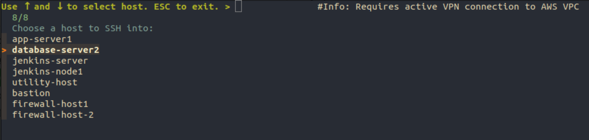

# SSH Host Selector Script

This script provides a convenient interface to select and SSH into hosts configured in your `~/.ssh/config` file using `fzf`, the command-line fuzzy finder.



## Prerequisites

Before using this script, make sure you have `fzf` installed on your system. If `fzf` is not installed, the script will prompt you to install it.

### Installing fzf

- On Ubuntu/Debian:
  ```bash
  sudo apt-get install fzf
  ```
- On Fedora:
  ```bash
  sudo dnf install fzf
  ```
- On Arch:
  ```bash
  sudo pacman -S fzf
  ```
- On macOS:
  ```bash
  brew install fzf
  ```

## Installation

1. Download the script to your preferred location.
2. Make the script executable:
   ```bash
   chmod +x ssh-select
   ```

## Usage

To use the script, simply run it from the terminal:

```bash
./ssh-select
```

The script will:
- Check if `fzf` is installed. If not, it will prompt you to install it.
- Parse your `~/.ssh/config` file for host names, excluding wildcard entries.
- Use `fzf` to display a list of hosts. You can navigate through this list using the arrow keys.
- Once a host is selected, the script will initiate an SSH connection to that host.

## SSH Config File Requirement

The script parses through your `~/.ssh/config` file and needs it to function properly. Ensure your SSH config file is properly set up with entries for each host you wish to connect to. Each entry should follow this structure:

```text
Host host-foo
  HostName 10.1.2.3
  IdentityFile ~/.ssh/identity1.pem
  User admin
  #Info: Requires active VPN connection to office.

Host host-bar
  HostName 10.9.1.22
  IdentityFile ~/.ssh/identity2.pem
  User ubuntu
  #Info: Does not require VPN connection.
```

The `#Info` comment line is optional and can be used to provide additional information about the host, which will be displayed in the script's preview window.

### Features

- **Color Scheme Customization**: The script uses a custom color scheme for `fzf` to improve visibility and user experience.
- **Preview Window**: When selecting a host, a preview window shows additional information if available, such as comments from the SSH config file that start with '#Info:'.
- **Easy Navigation**: The interface is designed for quick navigation, allowing you to find and connect to your hosts efficiently.

## Customization

Feel free to customize the `fzf` color scheme or any other part of the script to match your preferences.

## License

This script is released under the MIT License. See the `LICENSE` file for more details.
